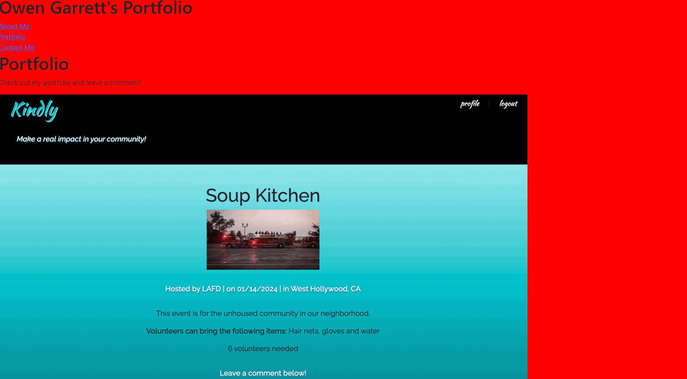

# React Portfolio

This is my portfolio that I made using React! Thank you for checking it out!

This was my first project that I utilized React. In order to work on my application, I would 'npm install' the necessary files before I entered in 'npm start' in the command line terminal. This would open a version of the app on local server 3000 where I could see my adjustments in real time. This was a very fun proejct and I will continue to work and update this portfolio as I aquire more skills! If you click the buttons, you will be taken to that corresponding page on my portfolio. On the "Contact Me" section, a user may enter in their credentials and they will be able to contact me! 

https://github.com/Sheogorath9/React-Portfolio/settings/pages

OG :alien: :yin_yang: